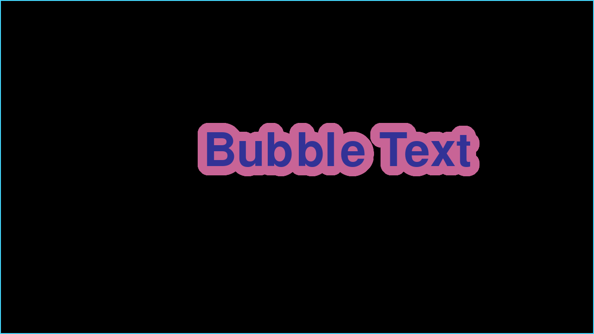

# Simple Bubble Text Demo (C++ - SDL2)
Simple Demo showing how to make Bubble using both Polar Coordinates trigonometry Algorithm and Bresenham's Circle Drawing Algorithm. https://www.geeksforgeeks.org/bresenhams-circle-drawing-algorithm/

# Build
To build the bubble-text binary you will need all required build tools needed to compile via Makefile and g++. You will also need SDL2 and ttf both the libraries and headerfiles. This was created in linux where the SDL2 headerfiles are in the SDL2 folder. In windows i believe the "SDL2/" may need to be removed.

## ArchLinux instructions.

    sudo pacman -S --needed base-devel
    sudo pacman -S --needed sdl2 sdl2_ttf
    make
    ./bubble-text
